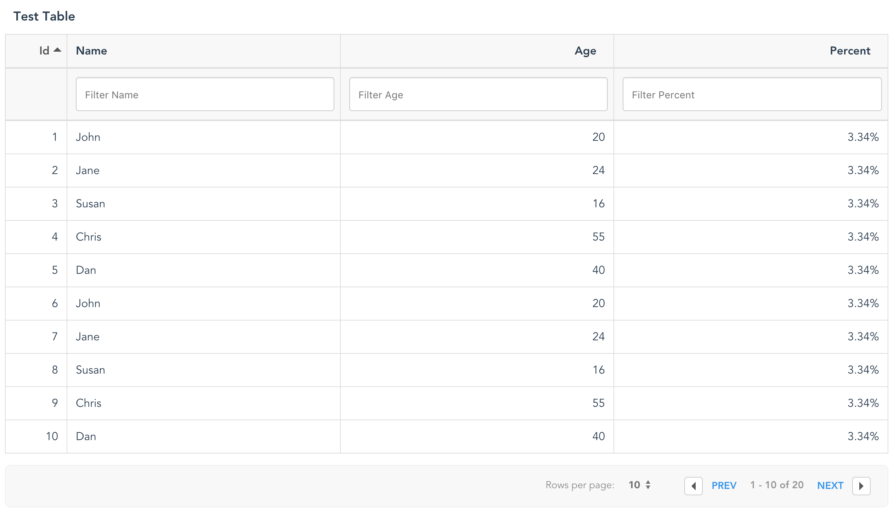
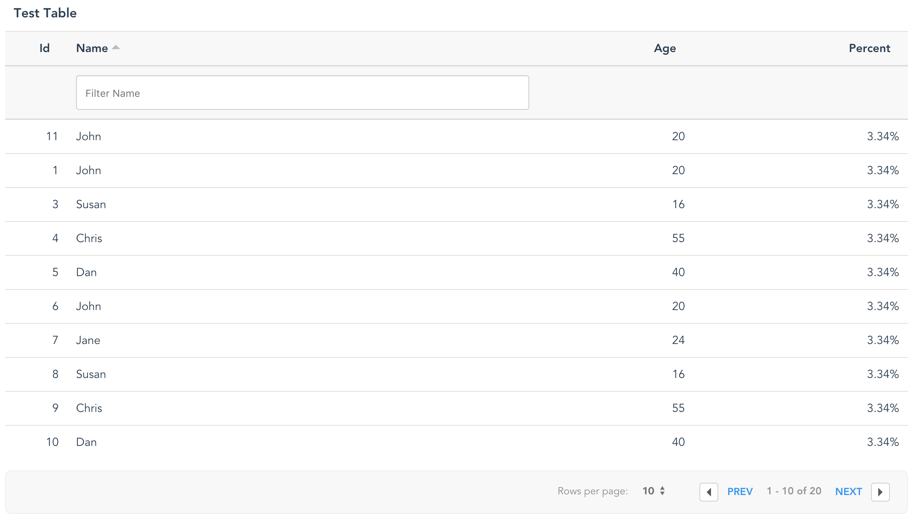
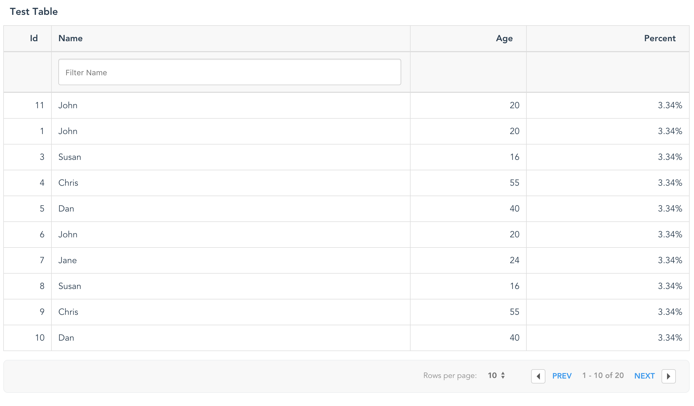
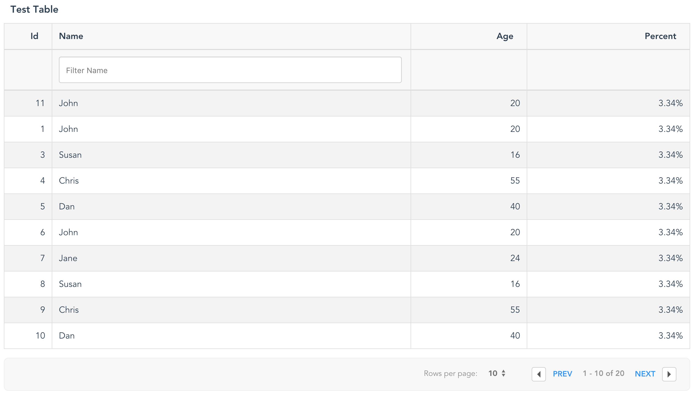
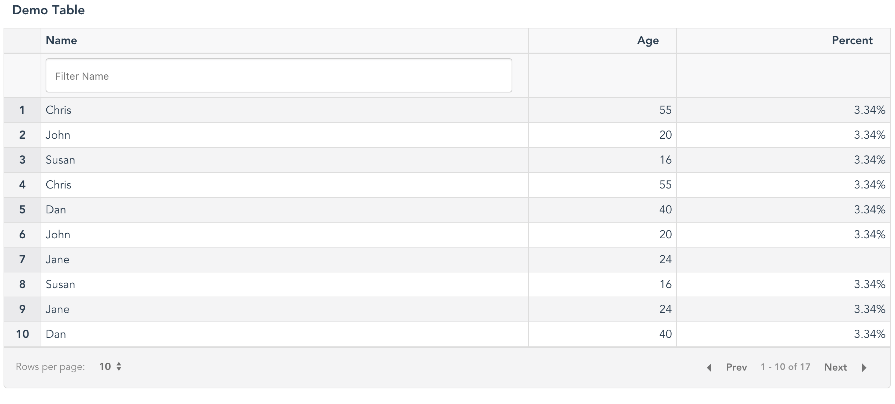

# Vue-good-table
A simple, clean data table for VueJS (2.x) with essential features like sorting, column filtering, pagination etc



## Live Demo

[vue-good-table Demo Site](https://xaksis.github.io/vue-good-demos/#/simple-table)

## Getting Started

### Prerequisites

The plugin is meant to be used with existing Vue 2.x projects. It uses ES6 features so as long as your build process includes a transpiler, you're good to go.


### Installing

Install with npm:
```
npm install --save vue-good-table
```

import into project:
```
import Vue from 'vue';
import VueGoodTable from 'vue-good-table';

Vue.use(VueGoodTable);
```


## Example Usage

```html
<template>
  <div>
    <vue-good-table
      title="Demo Table"
      :columns="columns"
      :rows="rows"
      :paginate="true"
      :lineNumbers="true"/>
  </div>
</template>

<script>
export default {
  name: 'test',
  data(){
    return {
      columns: [
        {
          label: 'Name',
          field: 'name',
          filterable: true,
        },
        {
          label: 'Age',
          field: 'age',
          type: 'number',
          html: false,
          filterable: true,
        },
        {
          label: 'Created On',
          field: 'createdAt',
          type: 'date',
          inputFormat: 'YYYYMMDD',
          outputFormat: 'MMM Do YY',
        },
        {
          label: 'Percent',
          field: 'score',
          type: 'percentage',
          html: false,
        },
      ],
      rows: [
        {id:1, name:"John",age:20,createdAt: '201-10-31:9:35 am',score: 0.03343},
        {id:2, name:"Jane",age:24,createdAt: '2011-10-31',score: 0.03343},
        {id:3, name:"Susan",age:16,createdAt: '2011-10-30',score: 0.03343},
        {id:4, name:"Chris",age:55,createdAt: '2011-10-11',score: 0.03343},
        {id:5, name:"Dan",age:40,createdAt: '2011-10-21',score: 0.03343},
        {id:6, name:"John",age:20,createdAt: '2011-10-31',score: 0.03343},
        {id:7, name:"Jane",age:24,createdAt: '20111031'},
        {id:8, name:"Susan",age:16,createdAt: '2013-10-31',score: 0.03343},
        {id:9, name:"Chris",age:55,createdAt: '2012-10-31',score: 0.03343},
        {id:10, name:"Dan",age:40,createdAt: '2011-10-31',score: 0.03343},
        {id:11, name:"John",age:20,createdAt: '2011-10-31',score: 0.03343},
        {id:12, name:"Jane",age:24,createdAt: '2011-07-31',score: 0.03343},
        {id:13, name:"Susan",age:16,createdAt: '2017-02-28',score: 0.03343},
        {id:14, name:"Chris",age:55,createdAt: '',score: 0.03343},
        {id:15, name:"Dan",age:40,createdAt: '2011-10-31',score: 0.03343},
        {id:19, name:"Chris",age:55,createdAt: '2011-10-31',score: 0.03343},
        {id:20, name:"Dan",age:40,createdAt: '2011-10-31',score: 0.03343},
      ],
    };
  },
};
</script>
```
This should result in the screenshot seen above

<strong>Note:</strong> vue-good-table also supports dynamic td templates where you dictate how to display the cells. Example:
```html
<vue-good-table
  title="Dynamic Table"
  :columns="columns"
  :rows="rows"
  :lineNumbers="true"
  :defaultSortBy="{field: 'age', type: 'asc'}"
  :globalSearch="true"
  :paginate="true"
  styleClass="table condensed table-bordered table-striped">
  <template slot="table-row" scope="props">
    <td>{{ props.row.name }}</td>
    <td class="fancy">{{ props.row.age }}</td>
    <td>{{ props.formattedRow.date }}</td>
    <td>{{ props.index }}</td>
  </template>
</vue-good-table>
```
**Note:** 
* The original row object can be accessed via `props.row`
* The currently displayed table row index can be accessed via `props.index` . 
* The original row index can be accessed via `props.row.originalIndex`. You can access the original row object by using `row[props.row.originalIndex]`.
* You can access the formatted row data (for example - formatted date) via `props.formattedRow` 

## Additional Columns
If you want the table to do all your rendering and want to add some columns to the beginning or end of the row, you can use additional slots: 
```html
<vue-good-table
  :columns="columns"
  :paginate="true"
  :rows="rows">
<template slot="table-row-before" slot-scope="props">
  <td><input type="checkbox" /></td>
</template>
<!-- all the regular row items will be populated here-->
<template slot="table-row-after" slot-scope="props">
  <td><button @click="doSomething(props.index)">show</button></td>
</template>
</vue-good-table>
```
**Note**
Make sure you add the columns in the columns array for the additional <code>td</code> that you create.


## Custom columns
Sometimes you might want to use custom column formatting. You can do that in the following way
```html
<vue-good-table
  :columns="columns"
  :paginate="true"
  :rows="rows">
  <template slot="table-column" scope="props">
     <span v-if="props.column.label =='Name'">
        <i class="fa fa-address-book"></i> {{props.column.label}}
     </span>
     <span v-else>
        {{props.column.label}}
     </span>
  </template>
</vue-good-table>
```

## Empty state slot

You can provide html for empty state slot as well. Example:

```html
<vue-good-table
  title="Dynamic Table"
  :columns="columns"
  :rows="rows"
  :lineNumbers="true"
  styleClass="table condensed table-bordered table-striped">
  <div slot="emptystate">
    This will show up when there are no columns
  </div>
</vue-good-table>
```

### Component Options

<table>
  <thead>
    <tr>
      <th>Option</th>
      <th>Description</th>
      <th>Type, Example</th>
    </tr>
  </thead>
  <tbody>
    <tr>
      <td>title</td>
      <td>Title shows up above the table</td>
      <td>String, <code>"Test Table"</code><br>
        If not set, the title region is not created.
      </td>
    </tr>
    <tr>
      <td>columns</td>
      <td>Array containing objects that describe table columns</td>
      <td>
<pre lang="javascript">
  [
    {
      label: 'Name',
      field: 'name',
      filterable: true,
    }
    //...
  ]
</pre>
      <em>For all column properties, see below</em>
      </td>
    </tr>
    <tr>
      <td>rows</td>
      <td>Array containing row objects</td>
      <td>
<pre lang="javascript">
  [
    {
      id:1,
      name:"John",
      age:20
    },
    //...
  ]
</pre>
      </td>
    </tr>
    <tr>
      <td>paginate</td>
      <td>Enable Pagination for table</td>
      <td>Boolean</td>
    </tr>
    <tr>
      <td>rtl</td>
      <td>Enable Right-To-Left layout for the table</td>
      <td>Boolean (<em>default: false</em>)</td>
    </tr>
    <tr>
      <td>perPage</td>
      <td>Number of rows per page</td>
      <td>Integer (<em>default: 10</em>)</td>
    </tr>
    <tr>
      <td>onClick</td>
      <td>Function to run when a row is clicked</td>
      <td>
<pre lang="javascript">
&lt;vue-good-table
      :columns=&quot;columns&quot;
      :onClick=&quot;onClickFn&quot;
      :rows=&quot;rows&quot;/&gt;
// data
data() {
  return {
   // rows, columns ...
    onClickFn: function(row, index){
      console.log(row); //the object for the row that was clicked on
      console.log(index); // index of the row that was clicked on
    },
  };
}
</pre>
      </td>
    </tr>
    <tr>
      <td>sortable</td>
      <td>Enable sorting by clicking column</td>
      <td>Boolean</td>
    </tr>
    <tr>
      <td>styleClass</td>
      <td>Allows applying your own classes to table</td>
      <td>String <em>default: 'table table-bordered'</em></td>
    </tr>
    <tr>
      <td>rowStyleClass</td>
      <td>Allows providing custom styles for rows</td>
      <td>it can be: 
        <ul>
          <li>string: 'my-class'</li>
          <li>function: 
<pre lang="javascript">
myStyleFn(row){ 
  // if row has something return a specific class 
  if(row.fancy) {
    return 'fancy-class';
  }
  return '';
}
</pre>
          </li>
        </ul>
      </td>
    </tr>
    <tr>
      <td>lineNumbers</td>
      <td>Enable sorting by clicking column</td>
      <td>Boolean <em>default: false</em></td>
    </tr>
    <tr>
      <td>defaultSortBy</td>
      <td>Allows specifying a default sort for the table on wakeup</td>
      <td>Object, example:
<pre lang="javascript">
{
  field: 'name',
  type: 'asc' //asc or desc (default: 'asc')
}
</pre>
      </td>
    </tr>
    <tr>
      <td>responsive</td>
      <td>Add responsive class to wrapper</td>
      <td>Boolean <em>default: true</em></td>
    </tr>
    <tr>
      <td>pageChanged</td>
      <td>event emitted on pagination change</td>
      <td>
      <pre lang="javascript">
      &lt;vue-good-table
      :columns="columns"
      :pageChanged="onPageChange($event)"
      :rows="rows"/&gt;
      data() {
      return {
       // rows, columns ...
        onPageChange: function(event){
          // { currentPage: 1, total: 5 }
          console.log(event);
        },
      };
    }
    </pre>
      </td>
    </tr>
    <tr>
      <td colspan="3">
        <strong>Search Options</strong>
      </td>
    </tr>
    <tr>
      <td>globalSearch</td>
      <td>Allows a single search input for the whole table <em>Note: enabling this filter disables column filters</em></td>
      <td>Boolean <em>default: false</em></td>
    </tr>
    <tr>
      <td>searchTrigger (used with global search)</td>
      <td>allows specifying searching on enter key rather than live search for large records</td>
      <td>String <em>searchTrigger="enter"</em></td>
    </tr>
    <tr>
      <td>externalSearchQuery</td>
      <td>Allows global search via your own input field</td>
      <td>Usage<br>
<pre lang="html">
    &lt;input type=&quot;text&quot; v-model=&quot;searchTerm&quot; /&gt;
    &lt;vue-good-table
      :columns=&quot;columns&quot;
      :paginate=&quot;true&quot;
      :externalSearchQuery=&quot;searchTerm&quot;
      :rows=&quot;rows&quot;/&gt;
</pre>
<pre lang="javascript">
  // and in data
  data(){
      return {
        searchTerm: '',
        // rows, columns etc...
      };
  }
</pre>
      </td>
    </tr>
    <tr>
      <td colspan="3">
        <strong>Text Options</strong> - for those interested in using other languages
      </td>
    </tr>
    <tr>
      <td>globalSearchPlaceholder</td>
      <td>Text for global search input place holder</td>
      <td>default: "Search Table"</td>
    </tr>
    <tr>
      <td>nextText</td>
      <td>Text for pagination 'Next' link </td>
      <td>default: "Next"</td>
    </tr>
    <tr>
      <td>prevText</td>
      <td>Text for pagination 'Prev' link </td>
      <td>default: "Prev"</td>
    </tr>
    <tr>
      <td>rowsPerPageText</td>
      <td>Text for pagination 'Rows per page' label </td>
      <td>default: "Rows per page"</td>
    </tr>
    <tr>
      <td>ofText</td>
      <td>Text for pagination 'x of y' label </td>
      <td>default: "of"</td>
    </tr>
  </tbody>
</table>

### Column Options
<table>
  <thead>
    <tr>
      <td>Option</td>
      <td>Description</td>
      <td>Type, example</td>
    </tr>
  </thead>
  <tbody>
    <tr>
      <td>label (required)</td>
      <td>Label to put on column header</td>
      <td>String <code>{label: "Name"}</code></td>
    </tr>
    <tr>
      <td>field (required)</td>
      <td>Row object property that this column corresponds to</td>
      <td>
        Could be:
        <ul>
          <li>String <code>eg: 'name'</code> - simple row property name</li>
          <li>String <code>eg: 'location.lat'</code>- nested row property name. lets say if the row had a property 'location' which was an object containing 'lat' and 'lon'
          </li>
          <li>Function - a function that returns a value to be displayed based on the row object
<pre lang="javascript">
  {
    field: fieldFn
  }
  
  // in methods
  fieldFn(rowObj) {
    // do something with the row object
  }
</pre>
          </li>
        </ul>
      </td>
    </tr>
    <tr>
      <td>type (optional)</td>
      <td>type of column. default: 'text'. This determines the formatting for the column and filter behavior as well</td>
      <td>
        Possible values:
        <ul>
          <li>number - right aligned</li>
          <li>decimal - right aligned, 2 decimal places</li>
          <li>percentage - expects a decimal like 0.03 and formats it as 3.00%</li>
          <li>date - expects a string representation of date eg <code>'20170530'</code></li>
        </ul>
      </td>
    </tr>
    <tr>
      <td>inputFormat <strong>(if type is date)</strong></td>
      <td>provide the format to parse date string</td>
      <td>String eg: <code>'YYYYMMDD' //where date strings are '20170530'</code></td>
    </tr>
    <tr>
      <td>outputFormat <strong>(if type is date)</strong></td>
      <td>provide the format for output date</td>
      <td>String eg: <code>'MMM Do YY' //where date will be output like 'May 30th 17'</code></td>
    </tr>
    <tr>
      <td>filterable (optional)</td>
      <td>enables filtering on column (By default, creates a text input)</td>
      <td>Boolean</td>
    </tr>
    <tr>
      <td>filterDropdown</td>
      <td>provides a dropdown for filtering instead of a text input</td>
      <td>Boolean</td>
    </tr>
    <tr>
      <td>filterOptions <strong>required for filterDropdown</strong></td>
      <td>provides options to dropdown filter
      </td>
      <td>
        array: 
        <code>filterOptions: ['Blue', 'Red', 'Yellow']</code>
          or
      <pre lang="javascript">
          filterOptions: [  
            { value: 'n', text: 'Inactive' },  
            { value: 'y', text: 'Active' },  
            { value: 'c', text: 'Check' }  
          ],
      </pre>
      </td>
    </tr>
    <tr>
      <td>filter (optional)</td>
      <td>Custom filter, function of two variables: <code>function(data, filterString)</code>,
      should return true if data matches the filterString, otherwise false.</td>
      <td>
      <pre lang="javascript">
          filter: function(data, filterString) {
            var x = parseInt(filterString)
            return data >= x-5 && data <= x+5
          }
      </pre>
      would create a filter matching numbers within 5 of the provided value.
      <td>
    </tr>
    <tr>
      <td>html (optional)</td>
      <td>indicates whether this column will require html rendering or not</td>
      <td>Boolean, example: if row had a property 'htmlContent' like <code>htmlContent: '&lt;button&gt;Hello&lt;/button&gt;'</code>, then html: true on the column will render a button</td>
    </tr>
    <tr>
      <td>width (optional)</td>
      <td>provide a width value for this column</td>
      <td>example: <code>width: '50px'</code></td>
    </tr>
    <tr>
      <td>hidden (optional)</td>
      <td>allow hiding a column on table</td>
      <td>Boolean</td>
    </tr>
    <tr>
      <td>tdClass (optional)</td>
      <td>provide custom class(es) to the td</td>
      <td>example: <code>tdClass: 'text-center'</code></td>
    </tr>
    <tr>
      <td>thClass (optional)</td>
      <td>provide custom class(es) to the th</td>
      <td>example: <code>thClass: 'custom-th-style'</code></td>
    </tr>
  </tbody>
</table>


### Style Options

Vue-good-table allows providing your own css classes for the table via **styleClass** option but it also has in-built classes that you can make use of

#### .table


#### .table .table-bordered


#### .table .table-stripped


#### .table .table-stripped .table-bordered .condensed



## Authors

* **Akshay Anand** - *Initial work* - [xaksis](https://github.com/xaksis)
* [Other Contributors](https://github.com/xaksis/vue-good-table/graphs/contributors)

## License

This project is licensed under the MIT License - see the [LICENSE.md](LICENSE) file for details

## Acknowledgments

Inspiration taken from
* MicroDroid's [vue-materialize-datatable](https://github.com/MicroDroid/vue-materialize-datatable)
* Bootstrap's [table styles](https://getbootstrap.com/)
