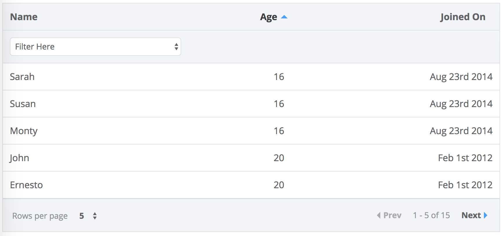
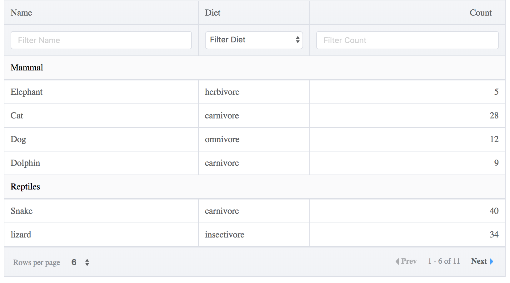
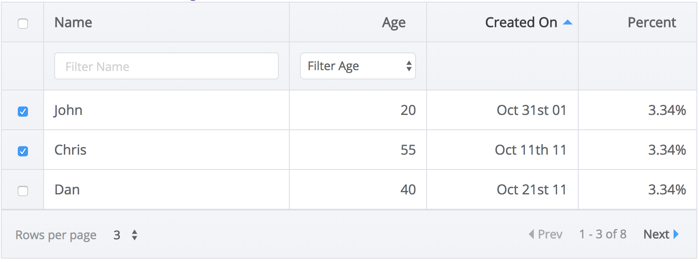
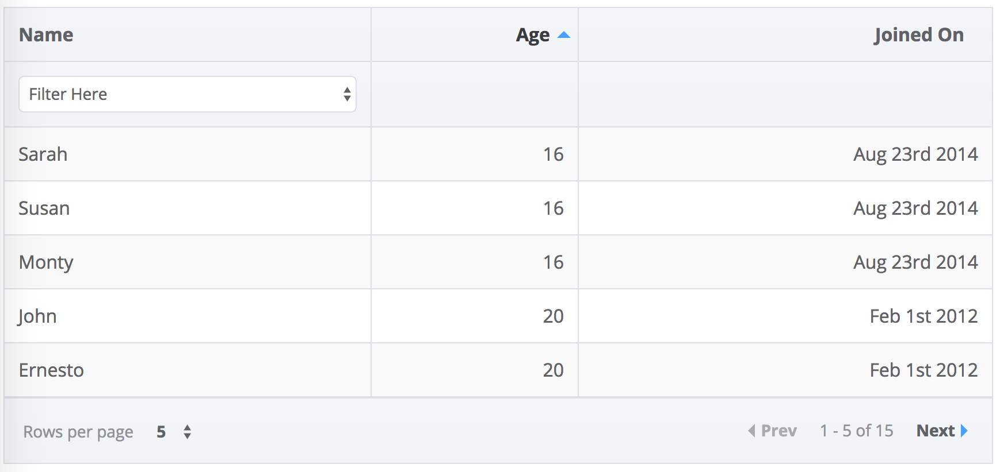
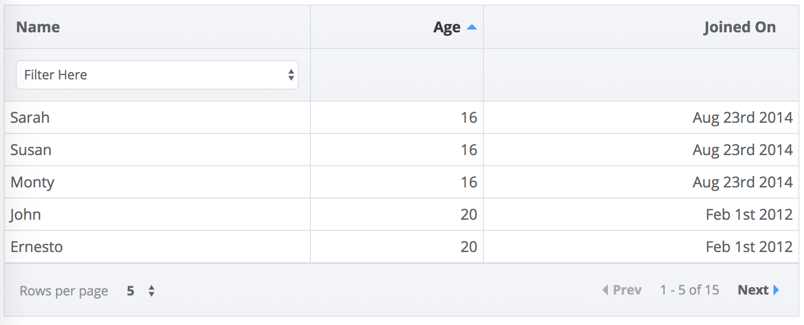
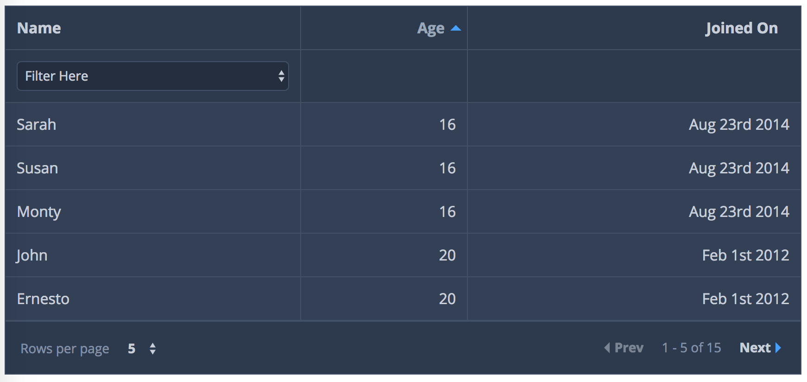
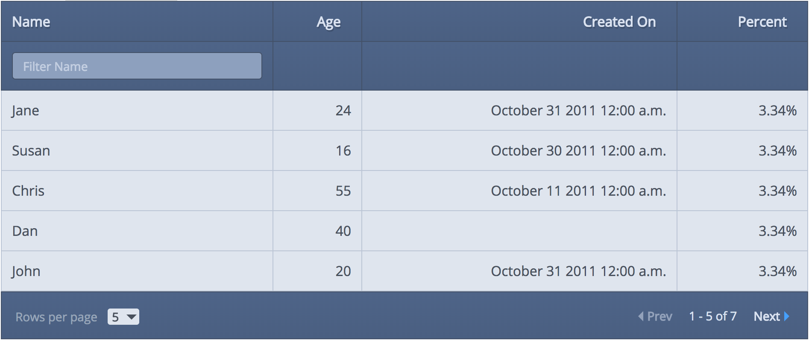

# Vue-good-table

[](https://www.npmjs.com/package/vue-good-table)
[](https://github.com/xaksis/vue-good-table/releases)
[](https://github.com/xaksis/vue-good-table/blob/master/LICENSE)
[](https://www.jsdelivr.com/package/npm/vue-good-table)
[](https://twitter.com/crayonbytes)

An easy to use, clean and powerful data table for VueJS with essential features like sorting, column filtering, pagination and much more - [xaksis.github.io/vue-good-table/](https://xaksis.github.io/vue-good-table/)

<!-- 
### Basic Table
 -->

<!-- ## Recipes
Some example recipes for inspiration 
[vue-good-table Recipes](https://github.com/xaksis/vue-good-table/wiki/Vue-good-table-Recipes-(vue-good-table-2.x)) -->
<!-- 
## Table of contents -->

<!-- START doctoc generated TOC please keep comment here to allow auto update -->
<!-- DON'T EDIT THIS SECTION, INSTEAD RE-RUN doctoc TO UPDATE -->

<!-- 
- [Getting Started](#getting-started)
  - [Installing](#installing)
  - [Example Usage](#example-usage)
- [Configuration](#configuration)
  - [Component Options](#component-options)
    - [Table](#table)
    - [Sort Options](#sort-options)
    - [Pagination Options](#pagination-options)
    - [Search Options](#search-options)
    - [Checkbox Table](#checkbox-table)
    - [Grouped Row Options](#grouped-row-options)
    - [Style/Theme](#styletheme)
  - [Column Options](#column-options)
    - [Column filter option in-depth](#column-filter-option-in-depth)
  - [Table Events](#table-events)
    - [@on-row-click](#on-row-click)
    - [@on-cell-click](#on-cell-click)
    - [@on-row-mouseenter](#on-row-mouseenter)
    - [@on-row-mouseleave](#on-row-mouseleave)
    - [@on-search](#on-search)
    - [@on-page-change](#on-page-change)
    - [@on-per-page-change](#on-per-page-change)
    - [@on-sort-change](#on-sort-change)
    - [@on-select-all](#on-select-all)
    - [@on-column-filter](#on-column-filter)
    - [@on-selected-rows-change](#on-selected-rows-change)
  - [Style Options](#style-options)
    - [.vgt-table](#vgt-table)
    - [.vgt-table .stripped](#vgt-table-stripped)
    - [.vgt-table .condensed](#vgt-table-condensed)
- [Themes](#themes)
  - [default](#default)
  - [nocturnal `theme='nocturnal'`](#nocturnal-themenocturnal)
  - [black-rhino `theme='black-rhino'`](#black-rhino-themeblack-rhino)
- [Advanced Customization](#advanced-customization)
  - [Custom row template](#custom-row-template)
  - [Custom column headers](#custom-column-headers)
  - [Grouped Rows](#grouped-rows)
  - [Remote Mode](#remote-mode)
  - [Table Actions Slot](#table-actions-slot)
  - [Empty state slot](#empty-state-slot)
- [Authors](#authors)
- [License](#license) -->

<!-- END doctoc generated TOC please keep comment here to allow auto update -->

## Installing

Install with npm:
```bash
npm install --save vue-good-table
```

Import globally in app:

```javascript
import VueGoodTablePlugin from 'vue-good-table';

// import the styles 
import 'vue-good-table/dist/vue-good-table.css'

Vue.use(VueGoodTablePlugin);
```

Import into your component
```js
import { VueGoodTable } from 'vue-good-table';

// add to component
components: {
  VueGoodTable,
}
```

Import into your component using Typescript
```typescript
// add to component
components: {
  'vue-good-table': require('vue-good-table').VueGoodTable,
}
```


##### Example table with grouped rows and column filters


## Features
* [Table Search](https://xaksis.github.io/vue-good-table/guide/configuration/search-options.html)
* [Sorting](https://xaksis.github.io/vue-good-table/guide/configuration/sort-options.html)
* [Column Filtering](https://xaksis.github.io/vue-good-table/guide/configuration/column-filter-options.html#filteroptions)
* [Pagination](https://xaksis.github.io/vue-good-table/guide/configuration/pagination-options.html)
* [Highly Customizable](https://xaksis.github.io/vue-good-table/guide/advanced/#custom-row-template)
* [Checkbox Table](https://xaksis.github.io/vue-good-table/guide/advanced/checkbox-table.html)
* [Grouped Rows Table](https://xaksis.github.io/vue-good-table/guide/advanced/grouped-table.html)
* [Server Powered Table](https://xaksis.github.io/vue-good-table/guide/advanced/remote-workflow.html#why-remote-mode)
* [Customizable Style and Themes](https://xaksis.github.io/vue-good-table/guide/style-configuration/)

## Upgrade Guide
Hey there! coming from 1.x? find the [upgrade guide here](https://github.com/xaksis/vue-good-table/wiki/Guide-to-upgrade-from-1.x-to-v2.0)

<!-- 
### Example Usage
```html
<template>
  <div>
    <vue-good-table
      :columns="columns"
      :rows="rows"
      :search-options="{
        enabled: true,
      }"
      :pagination-options="{
        enabled: true,
        perPage: 5,
      }"
      styleClass="vgt-table striped bordered"/>
  </div>
</template>

<script>
export default {
  name: 'my-component',
  data(){
    return {
      columns: [
        {
          label: 'Name',
          field: 'name',
          filterOptions: {
            enabled: true,
          },
        },
        {
          label: 'Age',
          field: 'age',
          type: 'number',
        },
        {
          label: 'Created On',
          field: 'createdAt',
          type: 'date',
          dateInputFormat: 'YYYY-MM-DD',
          dateOutputFormat: 'MMM Do YY',
        },
        {
          label: 'Percent',
          field: 'score',
          type: 'percentage',
        },
      ],
      rows: [
        { id:1, name:"John", age: 20, createdAt: '201-10-31:9: 35 am',score: 0.03343 },
        { id:2, name:"Jane", age: 24, createdAt: '2011-10-31', score: 0.03343 },
        { id:3, name:"Susan", age: 16, createdAt: '2011-10-30', score: 0.03343 },
        { id:4, name:"Chris", age: 55, createdAt: '2011-10-11', score: 0.03343 },
        { id:5, name:"Dan", age: 40, createdAt: '2011-10-21', score: 0.03343 },
        { id:6, name:"John", age: 20, createdAt: '2011-10-31', score: 0.03343 },
        { id:7, name:"Jane", age: 24, createdAt: '20111031' },
        { id:8, name:"Susan", age: 16, createdAt: '2013-10-31', score: 0.03343 },
      ],
    };
  },
};
</script>
``` -->
<!-- 
## Configuration
### Component Options
#### Table
These options relate to the table as a whole

##### columns `Array`

Array containing objects that describe table columns. The column object itself can contain many [configurable properties](#column-options).
```javascript
[
    {
      label: 'Name',
      field: 'name',
      filterable: true,
    }
    //...
]
```

##### rows `Array`

Array containing row objects. Each row object contains data that will be displayed in the table row.
```javascript
[
    {
      id:1,
      name:"John",
      age:20
    },
    //...
]
```
> for **grouped rows**, you need a nested format. Refer to [Grouped Rows](#grouped-rows) for an example.

##### rtl `Boolean (default: false)`

Enable Right-To-Left layout for the table
```html
<vue-good-table
  :columns="columns"
  :rows="rows"
  :rtl="true">
</vue-good-table>
```

##### lineNumbers `Boolean (default: false)`
Show line number for each row
```html
<vue-good-table
  :columns="columns"
  :rows="rows"
  :lineNumbers="true">
</vue-good-table>
```

##### mode `String`
Set mode=`remote` to allow sorting/filtering etc to be powered by server side instead of client side. Setting mode to remote, expects the following workflow:

* pagination, sort, filter, search will emit [Table Events](#table-events) (loading div appears) 
* setup handlers for each event
* in the handler call backend endpoints with the table params
* update rows object with the returned response ( the loading div will disappear once you update the rows object)

for a detailed workflow example check out [The remote mode workflow wiki](https://github.com/xaksis/vue-good-table/wiki/Remote-Mode-Workflow)

```html
<vue-good-table
  :columns="columns"
  :rows="rows"
  mode="remote">
</vue-good-table>
```


#### Sort Options
---
Set of options related to table sorting
```html
<vue-good-table
  :columns="columns"
  :rows="rows"
  :sort-options="{
    enabled: true,
    initialSortBy: {field: 'name', type: 'asc'}
  }">
</vue-good-table>
```

##### sortOptions.enabled `Boolean (default: true)`
Enable/disable sorting on table as a whole. 
```html
<vue-good-table
  :columns="columns"
  :rows="rows"
  :sort-options="{
    enabled: true,
  }">
</vue-good-table>
```

##### sortOptions.initialSortBy `Object`
Allows specifying a default sort for the table on wakeup
```html
<vue-good-table
  :columns="columns"
  :rows="rows"
  :sort-options="{
    enabled: true,
    initialSortBy: {field: 'name', type: 'asc'}
  }">
</vue-good-table>
```

```javascript
// in data
defaultSort: {
  field: 'name',
  type: 'asc' //asc or desc (default: 'asc')
}
```

#### Pagination Options
---
A set of options that are related to table pagination. Each of these are optional and reasonable defaults will be used if you leave off the property.
```html
<vue-good-table
  :columns="columns"
  :rows="rows"
  :paginationOptions="{
    enabled: true,
    perPage: 5,
    position: 'top',
    perPageDropdown: [3, 7, 9],
    dropdownAllowAll: false,
    setCurrentPage: 2,
    nextLabel: 'next',
    prevLabel: 'prev',
    rowsPerPageLabel: 'Rows per page',
    ofLabel: 'of',
    allLabel: 'All',
  }">
</vue-good-table>
```
Options explained below
##### paginationOptions.enabled `Boolean (default: false)`
Enable Pagination for table. By default the paginator is created at the bottom of the table.
```html
<vue-good-table
  :columns="columns"
  :rows="rows"
  :paginationOptions="{
    enabled: true
  }">
</vue-good-table>
```

##### paginationOptions.position `String (default: 'bottom')`
Add pagination on `'top'` or `'bottom'` (top and bottom) of the table (default position is bottom)
```html
<vue-good-table
  :columns="columns"
  :rows="rows"
  :paginationOptions="{
    enabled: true,
    position: 'top'
  }">
</vue-good-table>
```

##### paginationOptions.perPage `Integer (default: 10)`
Number of rows to show per page
```html
<vue-good-table
  :columns="columns"
  :rows="rows"
  :paginationOptions="{
    enabled: true,
    perPage: 5
  }">
</vue-good-table>
```

##### paginationOptions.perPageDropdown `Array (default: [10,20,30,40,50])`
Customize the dropdown options for the amount of items per page
```html
<vue-good-table
  :columns="columns"
  :rows="rows"
  :paginationOptions="{
    enabled: true,
    perPageDropdown: [3, 7, 9]
  }">
</vue-good-table>
```

##### paginationOptions.dropdownAllowAll `Boolean (default: true)`
enables/disables 'All' in the per page dropdown.
```html
<vue-good-table
  :columns="columns"
  :rows="rows"
  :paginationOptions="{
    enabled: true,
    perPageDropdown: [3, 7, 9],
    dropdownAllowAll: false,
  }">
</vue-good-table>
```

##### paginationOptions.setCurrentPage `Number`
set current page programmatically. 
> There's no validation for number of pages so please be careful using this.
```html
<vue-good-table
  :columns="columns"
  :rows="rows"
  :paginationOptions="{
    enabled: true,
    setCurrentPage: 2,
  }">
</vue-good-table>
```

##### pagination label/text options
you can change one or more of the texts shown on pagination by overriding the labels in the following way: 
```html
<vue-good-table
  :columns="columns"
  :rows="rows"
  :paginationOptions="{
    enabled: true,
    nextLabel: 'next',
    prevLabel: 'prev',
    rowsPerPageLabel: 'Rows per page',
    ofLabel: 'of',
    allLabel: 'All',
  }">
</vue-good-table>
```

#### Search Options
---
Set of search related options. These options pertain to the global table search.
```html
<vue-good-table
  :columns="columns"
  :rows="rows"
  :searchOptions="{
    enabled: true,
    trigger: 'enter',
    searchFn: mySearchFn,
    placeholder: 'Search this table',
    externalQuery: searchQuery
  }">
</vue-good-table>
```

Search options explained below

##### searchOptions.enabled `Boolean (default: false)`

Allows a single search input for the whole table 

>Note: enabling this option disables column filters
```html
<vue-good-table
  :columns="columns"
  :rows="rows"
  :searchOptions="{
    enabled: true
  }">
</vue-good-table>
```

##### searchOptions.trigger `String (default: '')`
Allows you to specify if you want search to trigger on 'enter' event of the input. By default table searches on key-up. 

```html
<vue-good-table
  :columns="columns"
  :rows="rows"
  :searchOptions="{
    enabled: true,
    trigger: 'enter'
  }">
</vue-good-table>
```

##### searchOptions.searchFn `Function`

Allows you to specify your own search function for the global search

```html
<vue-good-table
  :columns="columns"
  :rows="rows"
  :searchOptions="{
    enabled: true,
    searchFn: myFunc
  }">
</vue-good-table>
```
```javascript
// in js
methods: {
  myFunc(row, col, cellValue, searchTerm){
    return cellValue === 'my value';
  },
}
```

##### searchOptions.placeholder `String (default: 'Search Table')`
Text for global search input place holder
```html
<vue-good-table
  :columns="columns"
  :rows="rows"
  :searchOptions="{
    enabled: true,
    placeholder: 'Search this table',
  }">
</vue-good-table>
```

##### searchOptions.externalQuery `String`

If you want to use your own input for searching the table, you can use this property

```html
<input type="text" v-model="searchTerm" >
<vue-good-table
  :columns="columns"
  :rows="rows"
  :searchOptions="{
    enabled: true,
    externalQuery: searchTerm
  }">
</vue-good-table>
```
```javascript
// and in data
data(){
  return {
    searchTerm: '',
    // rows, columns etc...
  };
}
```

#### Checkbox Table
Creating table with selectable rows (checkboxes) is easier than ever. 


##### selectOptions `Object`
Object containing select options
```html
<vue-good-table
  @on-select-all="allSelected"
  @on-selected-rows-change="onSelectedRowsChange"
  @on-row-click="rowSelected"
  :columns="columns"
  :rows="rows"
  :selectOptions="{
    enabled: true,
    selectOnCheckboxOnly: true, // only select when checkbox is clicked instead of the row
    selectionInfoClass: 'custom-class',
    selectionText: 'rows selected',
    clearSelectionText: 'clear',
  }">
 ```

 you can get the selectedRows listening the [@on-selected-rows-change](#on-selected-rows-change) event.


#### Grouped Row Options
---
Sometimes you have a hierarchy in table and you want to group rows under subheadings, vue-good-table allows you to do that as well. Following properties relate to row grouping

##### groupOptions `Object`
Object containing group related options. 
```html
<vue-good-table
  :columns="columns"
  :rows="rows"
  :group-options="{
    enabled: true,
    headerPosition: 'bottom' 
  }">
 ```
> rows are formatted differently for grouped tables, refer to [Grouped Rows](#grouped-rows) section.

#### Style/Theme
---
Style options for table

##### styleClass `String (default:  'vgt-table bordered')`
Allows applying your own classes to table. Other in-built classes: condensed, striped, bordered
```html
<vue-good-table
  :columns="columns"
  :rows="rows"
  styleClass="vgt-table bordered striped">
</vue-good-table>
```

##### rowStyleClass `String or Function`

Allows providing custom styles for rows. It can be a string: 'my-class' or a function.
```html
<vue-good-table
  :columns="columns"
  :rows="rows"
  :rowStyleClass="myStyleFn">
</vue-good-table>
```
```javascript
// in methods
myStyleFn(row){ 
  // if row has something return a specific class 
  if(row.fancy) {
    return 'fancy-class';
  }
  return '';
}
```      

##### theme `String`
Allows using other themes. 
Included themes: 
* [nocturnal](#nocturnal-themenocturnal)
* [black-rhino](#black-rhino-themeblack-rhino)

```html
<vue-good-table
  :columns="columns"
  :rows="rows"
  theme="nocturnal">
</vue-good-table>
```


### Column Options
---
Each column objects can contain the following configuration options:


##### label `String`
Text to put on column header.

```javascript
columns: [
  { 
    label: 'name'
  },
  // ...
]
```

##### field `String`

Row object property that this column corresponds to. This can be: 

* String <code>eg: 'name'</code> - simple row property name
* String <code>eg: 'location.lat'</code>- nested row property name. lets say if the row had a property 'location' which was an object containing 'lat' and 'lon'
* Function - a function that returns a value to be displayed based on the row object
```javascript
columns: [
  { 
    label: 'name',
    field: this.fealdFn,
  },
  // ...
]
// in methods
fieldFn(rowObj) {
  return rowObj.name;
}
```

##### type `String`

type of column. default: 'text'. This determines the formatting for the column and filter behavior as well. Possible values:
* _number_ - right aligned
* _decimal_ - right aligned, 2 decimal places
* _percentage_ - expects a decimal like 0.03 and formats it as 3.00%
* _boolean_ - right aligned
* _date_ - expects a string representation of date eg `'20170530'`. You should also specify [dateInputFormat](#dateinputformat) and [dateOutputFormat](dateoutputformat)

```javascript
columns: [
  { 
    label: 'joined On',
    field: 'createdAt',
    type: 'date',
    dateInputFormat: 'YYYY-MM-DD', // expects 2018-03-16
    dateOutputFormat: 'MMM Do YYYY', // outputs Mar 16th 2018
  },
  // ...
]
```

##### dateInputFormat `String`
provide the format to parse date string

##### dateOutputFormat `String`
provide the format for output date

##### sortable `Boolean`
enable/disable sorting on columns. This property is higher priority than global sortable property
```javascript
columns: [
  { 
    label: 'name',
    field: 'user_name',
    sortable: false,
  },
  // ...
]
```

##### sortFn `Function`

custom sort function. If you want to supply your own sort function you can use this property.

```javascript
// in data
columns: [
  {
    label: 'Name',
    field: 'name',
    sortable: true,
    sortFn: this.sortFn,
  }
  //...
],
// in methods
methods: {
  sortFn(x, y, col, rowX, rowY) {
    // x - row1 value for column
    // y - row2 value for column
    // col - column being sorted
    // rowX - row object for row1
    // rowY - row object for row2
    return (x < y ? -1 : (x > y ? 1 : 0));
  }
}
```

##### formatFn `Function`
Allows for custom format of values, <code>function(value)</code>, should return the formatted value to display.

```javascript
// in data
columns: [
  {
    label: 'Salary',
    field: 'salary',
    sortable: true,
    formatFn: this.formatFn,
  }
  //...
],
// in methods
formatFn: function(value) {
  return '$' + value;
}
```

##### html `Boolean`
indicates whether this column will require html rendering. 
> The preferred way of creating columns that have html is by [using slots](#custom-row-template)
```javascript
// in data
columns: [
  {
    label: 'Action',
    field: 'btn',
    html: true,
  }
  //...
],
rows: [
  {
    btn: '<button>My Action</button>',
    // ...
  }
]
```

##### width `Number`
provide a width value for this column

```javascript
columns: [
  { 
    label: 'name',
    field: 'user_name',
    width: '50px',
  },
  // ...
]
```

##### hidden `Boolean`
hide a column
```javascript
columns: [
  { 
    label: 'name',
    field: 'user_name',
    hidden: true,
  },
  // ...
]
```

##### thClass `String`
provide custom class(es) to the table header
```javascript
columns: [
  { 
    label: 'name',
    field: 'user_name',
    thClass: 'custom-th-class',
  },
  // ...
]
```

##### tdClass `String`
provide custom class(es) to the table cells
```javascript
columns: [
  { 
    label: 'name',
    field: 'user_name',
    tdClass: 'text-center',
  },
  // ...
]
```

##### globalSearchDisabled `Boolean (default: false)`
if true, this column will be ignored by the global search
```javascript
columns: [
  { 
    label: 'name',
    field: 'user_name',
    globalSearchDisabled: true,
  },
  // ...
]
```

##### filterOptions `Object`
A collection of filter specific properties. You can find more about these properties in [column filter options section](#column-filter-option-in-depth)

```javascript
columns: [
  { 
    label: 'name',
    field: 'user_name',
    filterOptions: {
  	  enabled: true, // enable filter for this column
      placeholder: 'Filter This Thing', // placeholder for filter input
      filterValue: 'Jane', // initial populated value for this filter
      filterDropdownItems: [], // dropdown (with selected values) instead of text input
      filterFn: this.columnFilterFn, //custom filter function that
      trigger: 'enter', //only trigger on enter not on keyup 
    },
  },
  // ...
]
```

#### Column filter option in-depth
---
Some filterOption properties need a little more explanation

##### filterDropdownItems `Array of strings or Array of objects`
allows creating a dropdown for filter as opposed to an input

```javascript
//array
filterDropdownItems: ['Blue', 'Red', 'Yellow']
//or
filterDropdownItems: [  
  { value: 'n', text: 'Inactive' },  
  { value: 'y', text: 'Active' },  
  { value: 'c', text: 'Check' }  
],
```

##### filterFn `Function`
Custom filter, function of two variables: <code>function(data, filterString)</code>, should return true if data matches the filterString, otherwise false

```javascript
filterFn: function(data, filterString) {
  var x = parseInt(filterString)
  return data >= x - 5 && data <= x + 5;
}
// would create a filter matching numbers within 5 of the provided value
```

### Table Events

#### @on-row-click
event emitted on table row click
```html
<vue-good-table
  :columns="columns"
  :rows="rows"
  @on-row-click="onRowClick">
 ```
 ```javascript
 methods: {
   onRowClick(params) {
     // params.row - row object 
     // params.pageIndex - index of this row on the current page.
     // params.selected - if selection is enabled this argument 
     // indicates selected or not
     // params.event - click event
   }
 }
 ```

 #### @on-cell-click
event emitted on table cell click
```html
<vue-good-table
  :columns="columns"
  :rows="rows"
  @on-cell-click="onCellClick">
 ```
 ```javascript
 methods: {
   onCellClick(params) {
     // params.row - row object 
     // params.column - column object
     // params.rowIndex - index of this row on the current page.
     // params.event - click event
   }
 }
 ```
 
 #### @on-row-mouseenter
event emitted on row mouseenter
```html
<vue-good-table
  :columns="columns"
  :rows="rows"
  @on-row-mouseenter="onRowMouseover">
 ```
 ```javascript
 methods: {
   onRowMouseover(params) {
     // params.row - row object 
     // params.pageIndex - index of this row on the current page.
   }
 }
 ```
 
 #### @on-row-mouseleave
event emitted on table row mouseleave
```html
<vue-good-table
  :columns="columns"
  :rows="rows"
  @on-row-mouseleave="onRowMouseleave">
 ```
 ```javascript
 methods: {
   onRowMouseleave(row, pageIndex) {
     // row - row object 
     // pageIndex - index of this row on the current page.
   }
 }
 ```
 
#### @on-search
event emitted on global search (when global search is enabled)
```html
<vue-good-table
  :columns="columns"
  :rows="rows"
  @on-search="onSearch">
 ```
 ```javascript
 methods: {
   onSearch(params) {
     // params.searchTerm - term being searched for
     // params.rowCount - number of rows that match search
   }
 }
 ```
 
#### @on-page-change
event emitted on pagination page change (when pagination is enabled)
```html
<vue-good-table
  :columns="columns"
  :rows="rows"
  @on-page-change="onPageChange">
 ```
 ```javascript
 methods: {
   onPageChange(params) {
     // params.currentPage - current page that pagination is at
     // params.currentPerPage - number of items per page
     // params.total - total number of items in the table
   }
 }
 ```
 
#### @on-per-page-change
event emitted on per page dropdown change (when pagination is enabled)
```html
<vue-good-table
  :columns="columns"
  :rows="rows"
  @on-per-page-change="onPageChange">
```
```javascript
methods: {
  onPageChange(params) {
    // params.currentPage - current page that pagination is at
    // params.currentPerPage - number of items per page
    // params.total - total number of items in the table
  }
}
```

#### @on-sort-change
event emitted on sort change
```html
<vue-good-table
  :columns="columns"
  :rows="rows"
  @on-sort-change="onSortChange">
```
```javascript
methods: {
  onSortChange(params) {
    // params.sortType - ascending or descending
    // params.columnIndex - index of column being sorted
  }
}
```
 

#### @on-select-all
event emitted when all is selected (only emitted for checkbox tables)
```html
<vue-good-table
  :columns="columns"
  :rows="rows"
  @on-select-all="onSelectAll">
 ```
 ```javascript
 methods: {
   onSelectAll(params) {
     // params.selected - whether the select-all checkbox is checked or unchecked
     // params.selectedRows - all rows that are selected (this page)
   }
 }
 ```
 
 #on-selected-rows-change
 event emitted each time selectedRows has changed
 ```html
 <vue-good-table
   :columns="columns"
   :rows="rows"
   @on-selected-rows-change="onSelectedRowsChange">
  ```
  ```javascript
  methods: {
    onSelectedRowsChange(params) {
      // params.selectedRows - all rows that are selected (this page)
    }
  }
  ```
 
 #### @on-column-filter
event emitted when column is filtered (only emitted for remote mode)
```html
<vue-good-table
  :columns="columns"
  :rows="rows"
  @on-column-filter="onColumnFilter">
 ```
 ```javascript
 methods: {
   onColumnFilter(params) {
     // params.columnFilters - filter values for each column in the following format:
     // {field1: 'filterTerm', field3: 'filterTerm2')
   }
 }
 ```

### Style Options

Vue-good-table allows providing your own css classes for the table via **styleClass** option but it also has in-built classes that you can make use of

#### .vgt-table


#### .vgt-table .stripped


#### .vgt-table .condensed



## Themes

### default
### nocturnal `theme='nocturnal'`


### black-rhino `theme='black-rhino'`


## Advanced Customization

### Custom row template
vue-good-table also supports dynamic td templates where you dictate how to display the cells. Example:
```html
<vue-good-table
  :columns="columns"
  :rows="rows">
  <template slot="table-row" slot-scope="props">
    <span v-if="props.column.field == 'age'">
      age: {{props.row.age}}
    </span>
    <span v-else>
      {{props.formattedRow[props.column.field]}}
    </span>
  </template>
</vue-good-table>
```
**Note:** 
* The original row object can be accessed via `props.row`
* The currently displayed table row index can be accessed via `props.index` . 
* The original row index can be accessed via `props.row.originalIndex`. You can then access the original row object by using `rows[props.row.originalIndex]`.
* The column object can be accessed via `props.column`
* You can access the formatted row data (for example - formatted date) via `props.formattedRow`

### Custom column headers
Sometimes you might want to use custom column formatting. You can do that in the following way
```html
<vue-good-table
  :columns="columns"
  :rows="rows">
  <template slot="table-column" slot-scope="props">
     <span v-if="props.column.label =='Name'">
        <i class="fa fa-address-book"></i> {{props.column.label}}
     </span>
     <span v-else>
        {{props.column.label}}
     </span>
  </template>
</vue-good-table>
```

### Grouped Rows
To create grouped rows, you need two things. 
1. add groupOptions to table component
```html
<vue-good-table
  :columns="columns"
  :rows="rows"
  :groupOptions="{
  	enabled: true
  }">
</vue-good-table>
```

2. make sure the rows are formatted correctly. grouped rows need to be nested with headers rows containing rows in their children property. For example: 

```javascript
rows: [{
  mode: 'span', // span means this header will span all columns
  label: 'Header Two', // this is the label that'll be used for the header
  children: [
    { name: 'Chris', age: 55, createdAt: '2011-10-11', score: 0.03343 },
    { name: 'Dan', age: 40, createdAt: '2011-10-21', score: 0.03343 },
  ]
}]
```

3. sometimes, you might want a summary row instead of a header row. for example if you want to show total score for your group

```javascript
rows: [{
  name: 'Total', // this is the label that'll be used for the header
  age: undefined,
  createdAt: undefined,
  score: 0.3, // total score here
  children: [
    { name: 'Chris', age: 55, createdAt: '2011-10-11', score: 0.03343 },
    { name: 'Dan', age: 40, createdAt: '2011-10-21', score: 0.03343 },
  ]
}]
```

4. if you want the header/summary row to show up at the bottom of the group, you can specify that in the groupOptions property of the table.
```html
<vue-good-table
  :columns="columns"
  :rows="rows"
  :groupOptions="{
  	enabled: true,
    headerPosition: 'bottom',
  }">
</vue-good-table>
```

you can check out some live examples on the recipes page: 
[vue-good-table Recipes](https://github.com/xaksis/vue-good-table/wiki/Vue-good-table-Recipes-(vue-good-table-2.x))


### Remote Mode
Sometimes you might want to power the table from the backend. Where filtering, paging, sorting etc are done serverside. In order to accomplish that you can follow [The remote mode workflow wiki](https://github.com/xaksis/vue-good-table/wiki/Remote-Mode-Workflow)

### Table Actions Slot
If you want to add table specific actions like a print button for example, you can use the Table Actions Slot. If you have global search enabled, the action panel will show up to the right of that.

```html
<vue-good-table
  :columns="columns"
  :rows="rows">
  <div slot="table-actions">
    This will show up on the top right of the table. 
  </div>
</vue-good-table>
```


### Empty state slot
You can provide html for empty state slot as well. Example:

```html
<vue-good-table
  :columns="columns"
  :rows="rows">
  <div slot="emptystate">
    This will show up when there are no columns
  </div>
</vue-good-table>
``` -->

## Authors

* [xaksis](https://github.com/xaksis)
* [Other Contributors](https://github.com/xaksis/vue-good-table/graphs/contributors)

## License

This project is licensed under the MIT License - see the [LICENSE.md](LICENSE) file for details
